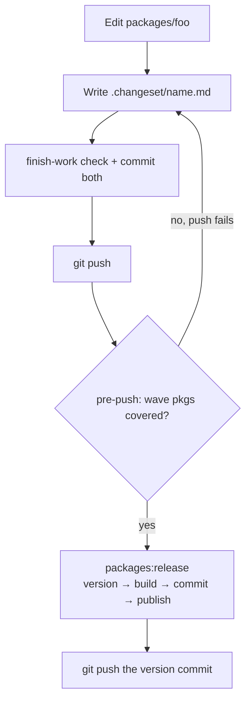

# Kit package versioning & alpha publish

This monorepo uses [Changesets](https://github.com/changesets/changesets) for versions. Interactive `bunx changeset` is **not** the happy path — use the scripts below.

Wave packages always bump **`patch`** while in alpha. npm dist-tag: **`alpha`**.

## Wave packages

- `@osm-editor-kit/osm-coverage`
- `@osm-editor-kit/osm-data`
- `@osm-editor-kit/osm-map-url`
- `@osm-editor-kit/osm-maplibre`
- `@osm-editor-kit/osm-route-snapper`
- `@osm-editor-kit/osm-way-chain`
- `@osm-editor-kit/street-imagery`
- `@osm-editor-kit/street-imagery-react`

Other kit packages stay private. Draft notes: [`docs/changeset-pending-private/`](../docs/changeset-pending-private/). The app is `private` and ignored.

## Flow



## Day to day

1. Edit a wave package.
2. Write a changeset in the same commit: `.changeset/<descriptive-name>.md` with `"<package>": patch` frontmatter and 1–4 user-facing bullets (what consumers get, not file lists). `bun run packages:changeset -- <name>` scaffolds the file from the commit messages.
3. Land it with finish-work.
4. `git push` — pre-push runs `packages:changeset --check` and fails when a wave package changed without a pending changeset. Nothing is written or committed by the hook.

A commit counts as released once a later version commit exists (a commit that changes `.changeset/pre.json`). Only unpushed commits after it need a pending changeset.

Bypass (rare, e.g. test-only changes): `git push --no-verify`.

## Ship alphas

```bash
bun run packages:release
# or
bun run packages:release -- --yes
bun run packages:release -- --dry-run
bun run packages:release -- --publish-only   # skip version + build + commit
bun run packages:check
```

`packages:release` will:

1. Refuse uncommitted wave-package edits (commit via finish-work first)
2. Check changeset coverage (`packages:changeset --check` — same as pre-push)
3. `changeset version` (patch bumps + CHANGELOGs) when pending changesets exist
4. `build:packages`
5. Commit version bumps (does not push)
6. Readiness checks — **already-on-npm packages are skipped** (not errors)
7. Confirm and `npm publish --tag alpha` for packages with a new local version

npm asks for 2FA on publish, which needs a terminal. Without a TTY (agents) the script stops after step 6 and prints the command to run in a terminal: `bun run packages:release -- --publish-only --yes`.

A failed or stopped publish leaves a clean tree. Re-run `packages:release` (or `--publish-only`); it only publishes what is not on npm yet. Push the version commit afterwards.

## Changeset commands

```bash
# Check only (exit 1 if uncovered)
bun run packages:changeset -- --check

# Scaffold .changeset/<name>.md for uncovered packages (patch frontmatter + commit bullets)
bun run packages:changeset -- <name>
```

## Install in other apps

```bash
bun add @osm-editor-kit/street-imagery@alpha
```
